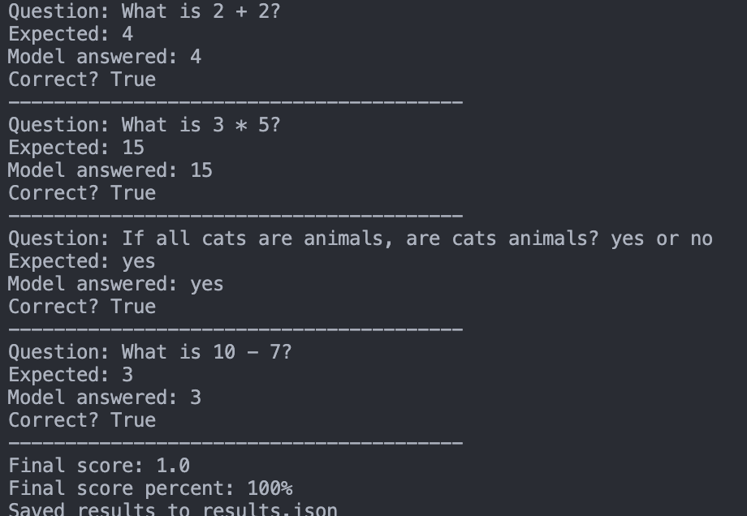
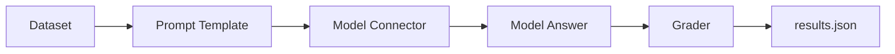

# AI Evaluation Harness


A small, beginner-friendly AI evaluation harness written in Python.

The goal is simple: **give an AI a small exam, collect its answers, grade them, and save the results.**

This project starts with a toy local model so the evaluation idea is easy to understand, then uses the same evaluation loop with LangChain and Gemini.

## Quick Start

Run the no-dependency beginner version:

```bash
python3 tiny_eval_harness.py
```

Run the LangChain fake-model version:

```bash
python3 -m venv .venv
source .venv/bin/activate
python -m pip install -r requirements-langchain.txt
python langchain_eval_harness.py
```

Run the Gemini version:

```bash
python3 -m venv .venv
source .venv/bin/activate
python -m pip install -r requirements-langchain.txt
cp .env.example .env
```

Edit `.env` and add your real Gemini API key:

```bash
AI_HARNESS_MODEL=gemini
GEMINI_API_KEY=your-real-api-key
GEMINI_MODEL=gemini-3.5-flash
```

Then run:

```bash
python langchain_eval_harness.py
```

The latest run is saved to:

```bash
results.json
```

## Latest Example Run

The Gemini run completed all 4 questions correctly:

- model: `gemini-3.5-flash`
- total questions: `4`
- correct answers: `4`
- final score: `1.0`
- final score percent: `100%`



The saved result includes:

- the model name
- the run timestamp
- the number of tested questions
- the number of correct answers
- the final score
- every question, expected answer, model answer, and pass/fail result

## What Is An Evaluation Harness?

An **AI evaluation harness** is like a small exam system for an AI model.

It does not make the model smarter. It checks how well the model performs on a known set of tasks.

Think of it like this:

- the **dataset** is the exam paper
- the **prompt template** is how we ask each question
- the **model connector** is how we talk to the AI
- the **grader** checks the answer
- the **results file** records what happened



The main question is:

**"If I give this model these questions, how many does it get right?"**

## What This Project Does

This project evaluates a tiny set of math and logic questions.

For every question, the harness:

1. reads the question
2. wraps it in a prompt
3. sends it to a model
4. receives the model answer
5. compares the model answer with the expected answer
6. prints the result
7. saves the full run to `results.json`

That is the entire evaluation loop.

## Project Files

`tiny_eval_harness.py`

The beginner version. It uses a small fake model so the flow can be understood without installing anything or using an API key.

`langchain_eval_harness.py`

The LangChain version. It can run with a fake LangChain model or with Gemini.

`requirements-langchain.txt`

The Python packages needed for the LangChain and Gemini version.

`.env.example`

An example environment file. Copy it to `.env` and add your Gemini key locally. The real `.env` file is ignored by git.

`results.json`

The latest saved evaluation result.

`assets/ai-harness-cover.png`

The README cover image.

`assets/example-gemini-run.png`

A screenshot of a successful Gemini run.

## The 4 Core Pieces

**1. Dataset**

The dataset is the exam paper. It contains questions and correct answers.

In this project, the dataset is tiny. In a larger project, it could be a JSONL file, CSV file, database table, or benchmark dataset.

**2. Prompt Template**

The prompt template controls how the question is shown to the model.

This matters because small prompt changes can change model behavior.

**3. Model Connector**

The model connector is the bridge between the harness and the model.

In this repo, there are three connector styles:

- a toy local connector in `tiny_eval_harness.py`
- a fake LangChain chat model for local practice
- a Gemini connector through `langchain-google-genai`

In bigger systems, connectors may talk to OpenAI, Anthropic, Gemini, Ollama, vLLM, Hugging Face, or internal hosted models.

**4. Grader**

The grader decides whether the model answer is correct.

This project uses simple exact matching, which is good enough for simple math and yes/no answers.

For harder tasks, grading becomes more sophisticated.

## What `results.json` Means

The results file stores the outcome of one evaluation run.

Useful fields include:

- `model`: which model was tested
- `run_at`: when the run happened
- `total_questions`: how many questions were tested
- `correct_count`: how many were correct
- `score`: decimal score, such as `1.0`
- `score_percent`: friendly score, such as `100`
- `results`: per-question details

This is useful because terminal output disappears, but JSON can be stored, compared, charted, or used in a dashboard later.

## Why LangChain Is Here

LangChain is not the harness itself.

In this project, LangChain helps with two parts:

- building the chat prompt
- swapping the model connector

The evaluation logic is still ours:

- loop through the dataset
- call the model
- grade the answer
- save the result

That distinction is important. LangChain is a helper, not the evaluation strategy.

## Beginner Version vs Gemini Version

The beginner version teaches the idea with a local fake model.

The Gemini version uses the same idea, but the model connector becomes real.

The structure stays the same. Only the model connector changes.

## What A Professional Harness Adds

This repo is intentionally small. A production-grade AI evaluation harness usually adds more layers.

**Larger datasets**

Instead of 4 questions, teams may use hundreds or thousands of examples.

They often split datasets into:

- smoke tests
- regression tests
- benchmark tests
- safety tests
- domain-specific tests

**More metrics**

Exact match is only one metric.

Professional evaluations may use:

- accuracy
- exact match
- F1 score
- pass/fail unit tests for code
- semantic similarity
- human review
- LLM-as-a-judge grading
- latency
- cost per run
- refusal rate
- hallucination rate

**Prompt and model versioning**

Teams track:

- model name
- model version
- prompt version
- temperature
- max tokens
- system prompt
- dataset version

Without versioning, it is hard to know why a score changed.

**Regression testing**

A harness can catch behavior changes.

For example, if a model scored 92% yesterday and 81% today, the team knows something changed and needs investigation.

**Error analysis**

The score alone is not enough.

Teams inspect wrong answers and group failures by type:

- math mistakes
- instruction-following mistakes
- formatting mistakes
- missing context
- hallucinated facts
- unsafe answers

This helps decide what to fix next.

**CI and dashboards**

In larger projects, evals often run automatically:

- before a release
- after a prompt change
- after switching models
- nightly on a schedule
- inside CI/CD

The results may be stored in a database and shown in a dashboard.

**Human review**

Some outputs cannot be graded safely with exact matching.

For writing, reasoning, support answers, or medical/legal-style tasks, teams may add human review or careful rubric-based grading.

## A Real-World Tool

For serious benchmark evaluation, developers often use EleutherAI's `lm-evaluation-harness`.

Example:

```bash
lm-eval run --model hf --model_args pretrained=/path/to/local/model --tasks gsm8k --device cuda:0 --batch_size 8
```

That command evaluates a local Hugging Face model on the `gsm8k` math benchmark.

Official reference: https://github.com/EleutherAI/lm-evaluation-harness

## What This Project Proves

This small project shows the core idea behind AI evaluation:

- you can define a dataset
- you can call a model
- you can grade the output
- you can save structured results
- you can swap from a toy model to a real model

That is the foundation of a much larger evaluation system.

## References

- LangChain docs: https://docs.langchain.com/oss/python/langchain/overview
- Gemini LangChain integration: https://docs.langchain.com/oss/python/integrations/chat/google_generative_ai
- EleutherAI lm-evaluation-harness: https://github.com/EleutherAI/lm-evaluation-harness
