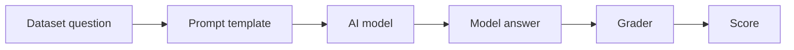

# AI Evaluation Harness

A tiny, beginner-friendly tutorial for understanding an AI Evaluation Harness from scratch.

## Quick Start

Run the no-dependency beginner version:

```bash
python3 tiny_eval_harness.py
```

Run the optional LangChain version:

```bash
python3 -m pip install -r requirements-langchain.txt
python3 langchain_eval_harness.py
```

## 1. The Big Picture (What is it anyway?)

An **AI Evaluation Harness** is like a **school exam for an AI**.

- The **dataset** is the exam paper.
- The **AI model** is the student.
- The **prompt** is how we ask each question.
- The **grader** checks the AI's answer against the answer key.
- The **final score** tells us how well the AI did.



That is the whole idea.

We are just asking:

**"When I give the AI these test questions, how many does it get right?"**

## 2. The 4 Core Pieces

**1. The Dataset (The exam questions)**

- A small list of questions.
- Each question has an expected correct answer.
- Example: `What is 2 + 2?` -> `4`

**2. The Prompt Template (How we wrap the question)**

- The raw question is not always sent alone.
- We usually wrap it with instructions.
- Example: `Answer only with the final answer. Question: What is 2 + 2?`

**3. The Model Connector (How we talk to the AI)**

- This is the part that sends the prompt to the AI.
- In a real project, this might call OpenAI, Hugging Face, Ollama, vLLM, or a local model.
- In our tiny version, we use a fake toy model so the flow is easy to see.

**4. The Grader/Evaluator (How we check if the answer is correct)**

- This compares the AI answer to the expected answer.
- For simple tasks, exact matching is fine.
- Example: model says `4`, answer key says `4`, so it is correct.

## 3. Step-by-Step Code (Python)

Save this as `tiny_eval_harness.py` and run it with:

```bash
python3 tiny_eval_harness.py
```

```python
dataset = [  # Create the tiny exam dataset that our AI will be tested on.
    {"question": "What is 2 + 2?", "expected": "4"},  # Add question 1 and its correct answer.
    {"question": "What is 3 * 5?", "expected": "15"},  # Add question 2 and its correct answer.
    {"question": "If all cats are animals, are cats animals? yes or no", "expected": "yes"},  # Add question 3 and its correct answer.
    {"question": "What is 10 - 7?", "expected": "3"},  # Add question 4 and its correct answer.
]  # Finish the dataset list.


def make_prompt(question):  # Define a function that turns a plain question into a prompt for the AI.
    prompt = f"Answer only with the final answer.\nQuestion: {question}"  # Add a simple instruction before the question.
    return prompt  # Give the finished prompt back to the rest of the program.


def ask_model(prompt):  # Define the model connector, which is where a real AI call would usually happen.
    if "2 + 2" in prompt:  # Check whether the prompt contains the first math question.
        return "4"  # Return the toy model's answer for that question.
    if "3 * 5" in prompt:  # Check whether the prompt contains the second math question.
        return "15"  # Return the toy model's answer for that question.
    if "cats are animals" in prompt:  # Check whether the prompt contains the logic question.
        return "yes"  # Return the toy model's answer for that question.
    if "10 - 7" in prompt:  # Check whether the prompt contains the subtraction question.
        return "2"  # Return a wrong answer on purpose so we can see the grader catch it.
    return "I don't know"  # Return a fallback answer if the toy model does not recognize the prompt.


def grade_answer(model_answer, expected_answer):  # Define the grader that compares the AI answer to the answer key.
    clean_model_answer = model_answer.strip().lower()  # Clean the model answer by removing spaces and ignoring case.
    clean_expected_answer = expected_answer.strip().lower()  # Clean the expected answer the same way.
    is_correct = clean_model_answer == clean_expected_answer  # Check whether the cleaned answers match exactly.
    return is_correct  # Send True or False back to say whether the model passed this question.


correct_count = 0  # Start a counter for how many answers the model gets right.

for item in dataset:  # Loop through every question in the dataset, one at a time.
    question = item["question"]  # Pull the question text out of the current dataset item.
    expected = item["expected"]  # Pull the correct answer out of the current dataset item.
    prompt = make_prompt(question)  # Turn the raw question into the prompt we will send to the model.
    model_answer = ask_model(prompt)  # Send the prompt to the model connector and get the model's answer.
    passed = grade_answer(model_answer, expected)  # Ask the grader whether the model answer is correct.
    if passed:  # Check whether the grader said this answer was correct.
        correct_count = correct_count + 1  # Add one point to the score.
    print("Question:", question)  # Show the question that was tested.
    print("Expected:", expected)  # Show the answer key for this question.
    print("Model answered:", model_answer)  # Show what the model returned.
    print("Correct?", passed)  # Show whether the grader marked it correct.
    print("-" * 40)  # Print a small divider so each result is easy to read.

total_questions = len(dataset)  # Count how many questions were in the dataset.
score = correct_count / total_questions  # Turn the number correct into a percentage-style score.

print("Final score:", score)  # Print the final score as a decimal, like 0.75.
print(f"Final score percent: {score * 100:.0f}%")  # Print the final score in a friendlier percent format.
```

What happens here:

- The harness asks **4 questions**.
- The toy model gets **3 right**.
- The grader catches the wrong answer.
- The final score becomes **75%**.

That is an evaluation harness in its smallest useful form.

## 4. How to Run a Real One

Once developers move beyond toy examples, they often use tools like EleutherAI's `lm-evaluation-harness`.

One-line local model example:

```bash
lm-eval run --model hf --model_args pretrained=/path/to/local/model --tasks gsm8k --device cuda:0 --batch_size 8
```

That means:

- `--model hf` says "use the Hugging Face model connector."
- `pretrained=/path/to/local/model` points to your local model folder.
- `--tasks gsm8k` chooses a math benchmark.
- `--device cuda:0` runs it on the first GPU.
- `--batch_size 8` tests 8 examples at a time.

Official reference: https://github.com/EleutherAI/lm-evaluation-harness

## Bonus: Same Idea With LangChain

LangChain does not replace the evaluation harness idea.

It mostly helps with the **prompt template** and the **model connector**.

In this repo, `langchain_eval_harness.py` uses LangChain for:

- building the prompt
- calling a chat model through one standard interface
- parsing the model output into plain text

For learning, it uses a fake LangChain chat model first. That means:

- no API key
- no paid model call
- same evaluation flow

Later, you can swap that fake model for a real OpenAI, Anthropic, Ollama, Hugging Face, or local model connector.

Official LangChain docs: https://docs.langchain.com/oss/python/langchain/overview
